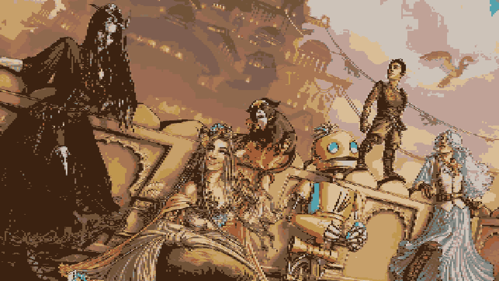
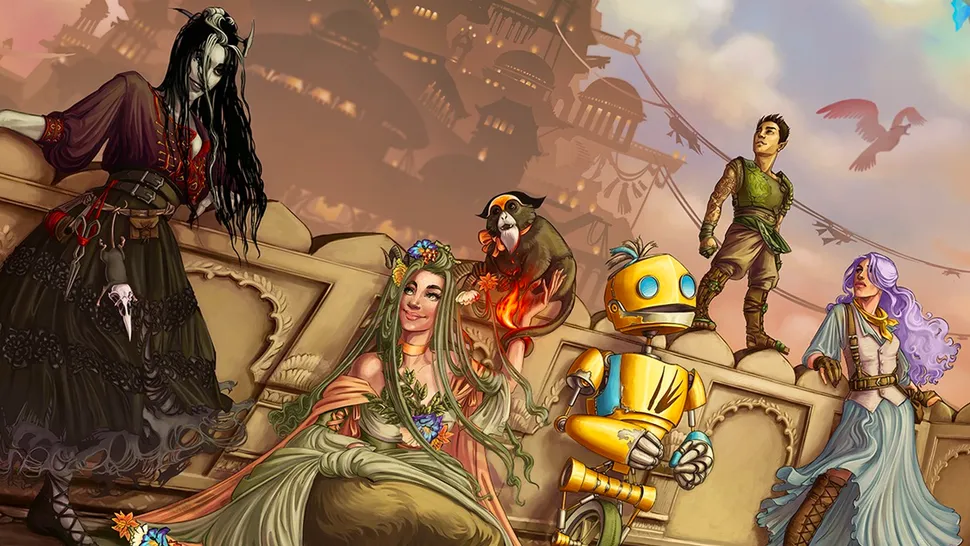
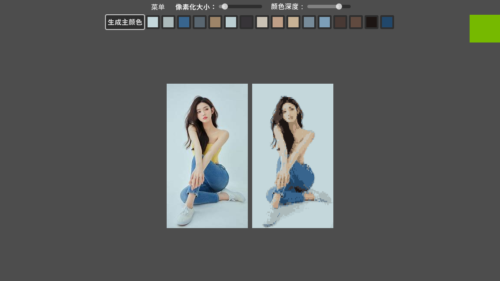

# Pixel Art Processor - Godot 4.4

一个基于 Godot 4.4 开发的像素艺术处理工具，能够将普通图片转换为像素艺术风格，并支持自定义调色板。

## 功能特点

- 图片像素化处理
- 智能调色板生成（使用中位切分算法）
- 自定义调色板编辑
- 像素级别和颜色级别调节
- 实时预览效果
- 支持多种图片格式（PNG、JPG、WebP等）
- 简单直观的用户界面

## 系统要求

- Godot 4.4 或更高版本
- Windows 10/11, macOS, Linux

## 使用方法

1. 启动程序
2. 点击菜单按钮，选择"打开图片"导入您想要处理的图像
3. 使用界面上的滑块调节：
   - 像素级别：控制像素化程度
   - 颜色级别：控制颜色量化程度
4. 点击"生成调色板"按钮，程序会自动分析图片并生成16色调色板
5. 在调色板区域，您可以点击任意颜色块进行自定义编辑
6. 点击菜单按钮，选择"保存"导出处理后的图片

## 技术特点

- 使用中位切分算法进行智能调色板生成
- 基于 Godot 的着色器系统实现实时预览
- 支持自定义调色板编辑和实时更新
- 优化的图像处理算法

## 许可证

本项目采用 MIT 许可证 - 查看 [LICENSE](LICENSE) 文件了解详情
