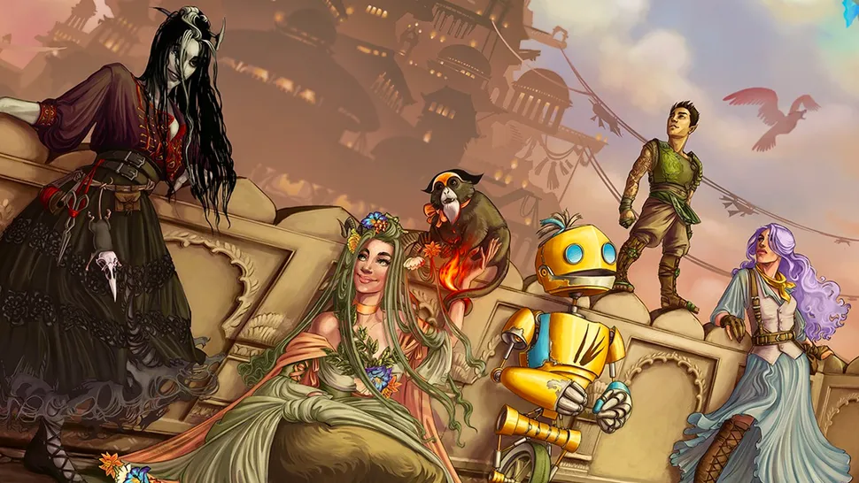

# Pixel Art Processor - Godot 4.4 图像处理工具




## 功能特性

### 核心处理功能
- ​**智能像素化**：可调节像素块尺寸 (1-512)
- ​**颜色量化**：支持2-128级颜色深度
- ​**调色板生成**：基于中位切分算法的16色自动提取
- ​**实时预览**：双视图同步显示处理效果（工作视图+用户视图）
- ​**批量导出**：支持PNG格式输出，自动生成时间戳文件名

### 高级特性
- 动态调色板编辑（颜色实时同步Shader）
- Alpha通道过滤（自动忽略透明像素）
- 智能下采样优化（128x加速处理）
- 颜色空间自动转换（sRGB <-> Linear）
- 交互式调色板：
  - 颜色拖拽排序
  - 双击编辑颜色
  - 十六进制值显示
  - 颜色锁定功能

## 技术规格

### 系统架构
```mermaid
graph TD
    A[主界面] --> B[图像输入]
    A --> C[处理管线]
    C --> D{{像素化Shader}}
    C --> E{{颜色量化Shader}}
    C --> F[调色板系统]
    F --> G[中位切分算法]
    F --> H[动态UI生成]
    A --> I[输出系统]